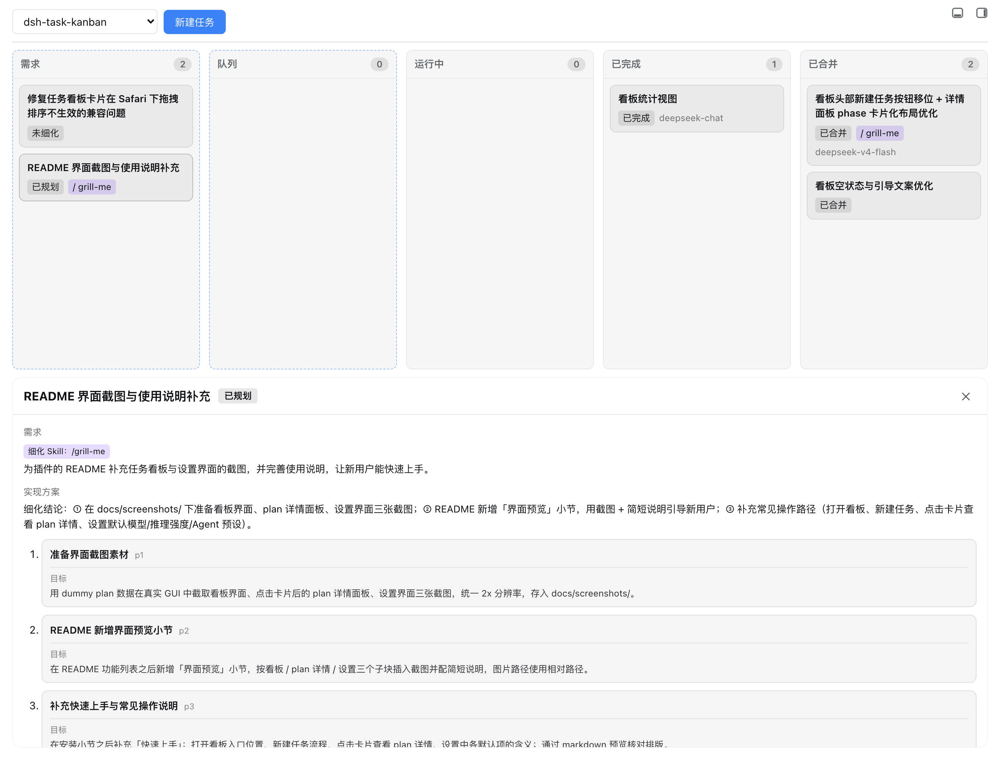
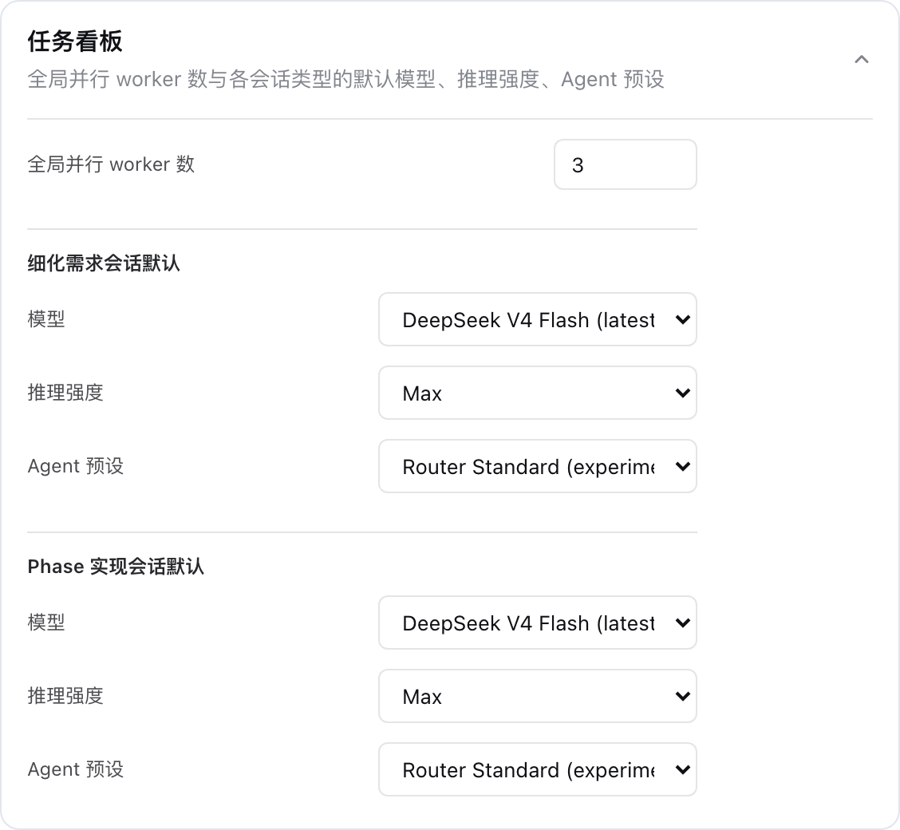

# dsh-task-kanban

**@fonlan/dsh-task-kanban** 是一个 [DSH](https://github.com/deepseek-ai/dsh) web 插件，为 web 主界面新增"任务看板"：把需求细化成多 phase 实现计划，并在 git worktree 中串行实现、全部 phase 完成后自动合入主分支，全流程状态在"需求 / 队列 / 运行中 / 已完成 / 已合并"五条泳道上可视化。

## 界面预览



任务看板把卡片按「需求 / 队列 / 运行中 / 已完成 / 已合并」五条泳道可视化，卡片显示标题、需求摘要、模型、细化 Skill、plan 状态徽标与所属阶段；点击任意卡片，页面下方会展开 plan 详情面板：需求、实现方案摘要，以及按 phase 卡片化展示的目标 / 会话 / 结论，并支持停止 / 重试 / 删除等操作。



打开看板：侧边栏「新建会话」下方的「任务看板」面板入口（与「插件」并列）。设置页：设置 → 侧边栏「任务看板」页，可配置全局并行 worker 数，以及细化需求会话与 Phase 实现会话各自的默认模型、推理强度与 Agent 预设。

## 功能

- **需求 → 计划**：新建任务后自动进入细化会话，把需求拆解为串行执行的 phase 计划（plan）。
- **Skill 驱动的需求细化**：在新建任务的需求输入框开头输入 `/` 会弹出可用的 Skill 列表（与聊天输入框一致，来自宿主 skill 目录；支持方向键 / Enter / Tab 选择），选中或手动输入 `/skill-name`（如 `/grill-me 帮我规划…`）即可指定细化时使用的 Skill。插件会把该 Skill 的完整指令注入细化会话，并切换到交互式细化模式——细化会话是显式会话，agent 会按 Skill 的指引（如 grill-me 的深度追问）与你在会话中交流打磨需求，直到需求明确后再写回计划。未知/不可用的 Skill 会给出明确报错并可重试。
- **队列**：已规划的卡片拖入队列，按 FIFO 领取执行。
- **串行实现**：每个 phase 一个独立会话，在同一 git worktree 中严格串行推进（同一工作区单并发，跨工作区可按设置并行）。
- **自动合并**：全部 phase 完成后，插件自动将 plan 分支合入主分支（`main` / `master`），完成后清理 worktree 与分支。
- **状态可视化**：卡片完整显示标题、需求摘要、模型、细化 Skill、plan 状态徽标、所属阶段与时间，支持停止 / 重试 / 删除。

## 设置

设置 → 侧边栏「任务看板」页（`settings.section` 插槽）支持：

- **全局并行 worker 数**：跨工作区同时执行的卡片数上限。
- **细化需求会话默认 / Phase 实现会话默认**：分别配置两类会话的默认值：
  - **模型**：留空表示走默认链路（卡片模型 → 宿主默认模型）。
  - **推理强度**：仅列出所选模型支持的推理等级；留空表示使用提供方默认。
  - **Agent 预设**：留空表示使用部署默认预设；会话开始后固定，恢复时会话按记录重建同一预设。

新建任务弹窗不再预填卡片模型，卡片模型保持为空即可让细化 / 实现会话各自套用上述默认值。

## 安装

> 通过 `dsh` 的 profile 插件管理命令安装，目标 profile 为 `web`。运行命令的目录将作为默认 workspace 根目录。

### 方式一：从 npm 发布包安装

当前发布版本：`0.2.6`（适配 DSH `0.1.7-alpha.1`）。

```sh
dsh plugin --profile web add @fonlan/dsh-task-kanban
```

> 如需固定版本，可显式指定版本号：`dsh plugin --profile web add @fonlan/dsh-task-kanban@0.2.6`。

### 方式二：本地源码链接安装

在仓库目录下，先构建出 `lib/` 产物（`package.json` 的 `files` 只发布 `lib / src / cordis.patch.yml / README.md / LICENSE`），再以本地目录方式添加：

```sh
pnpm build
dsh plugin --profile web add .
```

安装后插件即通过 `cordis.patch.yml` 自动挂载到 web profile。web profile 会读取该 patch，并把看板注册为**全局主面板**：侧边栏「新建会话」下方的面板行出现「任务看板」入口（`sidebar.panellist`，与「插件」并列），点击即把看板切到中央区域（`main` keyed 槽位，key = `task-kanban`）；设置页入口走 `settings.section`。点侧栏会话会先把中央区域交还给会话视图。

> 入口位置在 DSH `0.1.7` 起改为面板行（旧版是 `sidebar.footer.action` 的侧栏底部按钮）：底部那一行归 Settings 独占，插件按钮挤在同一行会把设置触发按钮压窄。

## 开发

- 修改服务端后需重启 web profile。
- 客户端改动走 web 端 HMR 链路，`pnpm run dev:web` 同启时生效。

## License

MIT — 详见 [LICENSE](./LICENSE)。
